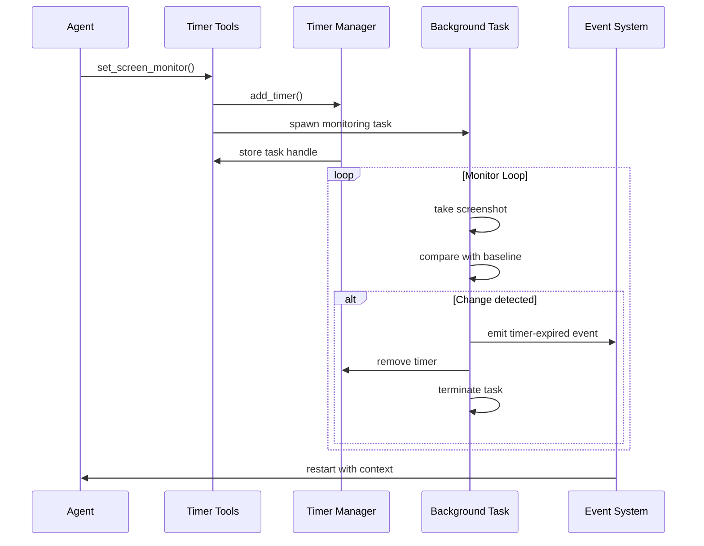

# Enhanced Timer System Documentation

## Table of Contents
1. [Overview](#overview)
2. [Getting Started](#getting-started)
3. [Timer Types](#timer-types)
4. [API Reference](#api-reference)
5. [Implementation Details](#implementation-details)
6. [Examples](#examples)
7. [Troubleshooting](#troubleshooting)
8. [Performance Considerations](#performance-considerations)

## Overview

The Enhanced Timer System is a comprehensive solution for agent pause/resume capabilities in the Juno AI Assistant. It enables agents to:

- **Pause and Resume**: Temporarily stop execution and automatically restart when conditions are met
- **Monitor External Events**: Watch for screen changes, file modifications, or application state changes
- **Schedule Operations**: Set delayed execution for future tasks
- **Context Preservation**: Maintain state and context across pause/resume cycles

### Key Features

- ✅ **Simple Timers**: Basic delay-based alarms
- ✅ **Screen Monitoring**: Visual change detection in screen regions
- ✅ **File Monitoring**: File system event detection
- ✅ **Application Monitoring**: App lifecycle event tracking
- ✅ **Background Processing**: Non-blocking monitoring tasks
- ✅ **Resource Management**: Automatic cleanup and memory efficiency
- ✅ **Cross-Platform**: Works on macOS with platform-specific optimizations

## Getting Started

### Prerequisites
- Juno AI Assistant with Tauri v2
- macOS (for screen monitoring features)
- Accessibility permissions (for screen capture)

### Basic Usage

```javascript
// Set a simple 30-second timer
await invoke('set_timer', {
  delay_seconds: 30,
  context: { 
    task: 'check_status',
    priority: 'high'
  },
  description: 'Status check reminder'
});

// Monitor a file for changes
await invoke('set_file_monitor', {
  file_path: '/path/to/important/file.txt',
  monitor_type: 'Modified',
  check_interval_seconds: 5,
  max_duration_seconds: 3600,
  context: {
    action: 'process_file_update',
    file_type: 'configuration'
  },
  description: 'Configuration file monitor'
});
```

## Timer Types

### 1. Simple Timer

Basic countdown timer that triggers after a specified delay.

**When to use:**
- Scheduled reminders
- Game timeouts
- Delayed operations
- Break timers

**Configuration:**
```rust
TimerType::Simple
// Uses only trigger_time field
```

### 2. Screen Monitor

Monitors screen regions for visual changes using screenshot comparison.

**When to use:**
- Gaming (waiting for events, enemies, UI changes)
- Dashboard monitoring
- UI automation
- Visual regression testing

**Configuration:**
```rust
TimerType::ScreenMonitor {
    region: Option<ScreenRegion>,      // Optional area to monitor
    threshold: f32,                    // Change percentage (0.0-1.0)
    check_interval_seconds: u64,       // Frequency of checks
}

pub struct ScreenRegion {
    pub x: f64,        // X coordinate (pixels)
    pub y: f64,        // Y coordinate (pixels)
    pub width: f64,    // Width (pixels)
    pub height: f64,   // Height (pixels)
}
```

### 3. File Monitor

Monitors file system events for specific files.

**When to use:**
- Processing uploaded files
- Log monitoring
- Configuration file changes
- Download completion detection

**Configuration:**
```rust
TimerType::FileMonitor {
    file_path: String,
    monitor_type: FileMonitorType,
}

pub enum FileMonitorType {
    Created,      // File is created
    Modified,     // File content is modified
    Deleted,      // File is deleted
    SizeChanged,  // File size changes
}
```

### 4. Application Monitor

Monitors application lifecycle events.

**When to use:**
- App automation workflows
- Focus-based triggers
- Application coordination
- Workspace management

**Configuration:**
```rust
TimerType::ApplicationMonitor {
    app_name: String,
    monitor_state: AppMonitorState,
}

pub enum AppMonitorState {
    Launched,      // Application starts
    Terminated,    // Application closes
    BecameFocused, // Application gains focus
    LostFocus,     // Application loses focus
}
```

## API Reference

### set_timer

Sets a simple delay-based timer.

**Parameters:**
- `delay_seconds` (number): Seconds to wait before triggering
- `context` (object): JSON context to restore when triggered
- `description` (string): Human-readable description

**Returns:**
```json
{
  "success": true,
  "timer_id": "uuid-string",
  "trigger_time": 1701234567,
  "message": "Timer set successfully"
}
```

**Example:**
```javascript
const result = await invoke('set_timer', {
  delay_seconds: 300,
  context: {
    reminder: 'take_break',
    activity: 'coding_session'
  },
  description: '5-minute coding break reminder'
});
```

### set_screen_monitor

Sets up screen region monitoring with visual change detection.

**Parameters:**
- `region` (object, optional): Screen region to monitor
  - `x` (number): X coordinate in pixels
  - `y` (number): Y coordinate in pixels  
  - `width` (number): Width in pixels
  - `height` (number): Height in pixels
- `threshold` (number): Change percentage threshold (0.0-1.0)
- `check_interval_seconds` (number): How often to check for changes
- `max_duration_seconds` (number, optional): Maximum monitoring duration
- `context` (object): JSON context to restore when triggered
- `description` (string): Human-readable description

**Returns:**
```json
{
  "success": true,
  "monitor_id": "uuid-string",
  "monitoring": true,
  "message": "Screen monitor started successfully"
}
```

**Example:**
```javascript
const result = await invoke('set_screen_monitor', {
  region: {
    x: 100,
    y: 200,
    width: 300,
    height: 100
  },
  threshold: 0.05,
  check_interval_seconds: 2,
  max_duration_seconds: 1800,
  context: {
    game_state: 'waiting_for_enemy',
    level: 5,
    character: 'warrior'
  },
  description: 'Monitor enemy spawn area'
});
```

### set_file_monitor

Sets up file system monitoring.

**Parameters:**
- `file_path` (string): Absolute path to file to monitor
- `monitor_type` (string): Type of change to monitor
  - `"Created"`: File creation
  - `"Modified"`: File modification
  - `"Deleted"`: File deletion
  - `"SizeChanged"`: File size change
- `check_interval_seconds` (number): How often to check file
- `max_duration_seconds` (number, optional): Maximum monitoring duration
- `context` (object): JSON context to restore when triggered
- `description` (string): Human-readable description

**Returns:**
```json
{
  "success": true,
  "monitor_id": "uuid-string",
  "monitoring": true,
  "message": "File monitor started successfully"
}
```

**Example:**
```javascript
const result = await invoke('set_file_monitor', {
  file_path: '/Users/username/Downloads/report.pdf',
  monitor_type: 'Created',
  check_interval_seconds: 5,
  max_duration_seconds: 3600,
  context: {
    action: 'process_report',
    user_id: 12345,
    report_type: 'monthly'
  },
  description: 'Monitor for report download completion'
});
```

### cancel_timer

Cancels any active timer or monitor.

**Parameters:**
- `timer_id` (string): ID of timer/monitor to cancel

**Returns:**
```json
{
  "success": true,
  "message": "Timer cancelled successfully"
}
```

**Example:**
```javascript
const result = await invoke('cancel_timer', {
  timer_id: 'timer-uuid-to-cancel'
});
```

### list_timers

Lists all active timers and monitors.

**Parameters:** None

**Returns:**
```json
{
  "success": true,
  "active_timers": [
    {
      "id": "uuid-1",
      "trigger_time": 1701234567,
      "description": "Timer description",
      "timer_type": "Simple",
      "created_at": 1701234500
    }
  ]
}
```

### check_expired_timers

Checks for and processes expired simple timers.

**Parameters:** None

**Returns:**
```json
{
  "success": true,
  "expired_timers": ["uuid-1", "uuid-2"],
  "processed_count": 2
}
```

## Implementation Details

### Architecture

The timer system is built with a modular architecture:

```
┌─────────────────┐    ┌──────────────────┐    ┌─────────────────┐
│   Timer Tools   │───▶│  Timer Manager   │───▶│ Background Tasks│
│                 │    │                  │    │                 │
│ • set_timer     │    │ • Active Timers  │    │ • Screen Monitor│
│ • set_*_monitor │    │ • Monitoring     │    │ • File Monitor  │
│ • cancel_timer  │    │   Tasks          │    │ • App Monitor   │
│ • list_timers   │    │ • State Mgmt     │    │                 │
└─────────────────┘    └──────────────────┘    └─────────────────┘
                                │
                                ▼
                       ┌──────────────────┐
                       │   Event System   │
                       │                  │
                       │ • timer-expired  │
                       │ • Agent Restart  │
                       │ • Context Restore│
                       └──────────────────┘
```

### State Management

The system uses thread-safe state management:

```rust
pub struct TimerManager {
    // Thread-safe storage of active timers
    pub active_timers: Arc<Mutex<HashMap<String, TimerTask>>>,
    
    // Background task handles for cleanup
    pub monitoring_tasks: Arc<Mutex<HashMap<String, tokio::task::JoinHandle<()>>>>,
}
```

### Background Task Lifecycle

1. **Task Creation**: When a monitoring timer is set, a background task is spawned
2. **Monitoring Loop**: Task runs periodic checks based on timer type
3. **Trigger Detection**: When condition is met, task emits event and terminates
4. **Cleanup**: Task handle is removed from monitoring_tasks map

### Event Flow



## Examples

### Gaming Scenario

```javascript
// Monitor for enemy appearance in specific screen region
async function waitForEnemy() {
  const result = await invoke('set_screen_monitor', {
    region: {
      x: 800,   // Right side of screen
      y: 400,   // Middle height
      width: 200,
      height: 200
    },
    threshold: 0.1,  // 10% change threshold
    check_interval_seconds: 1,  // Check every second
    max_duration_seconds: 300,  // Max 5 minutes
    context: {
      game_state: 'combat_ready',
      player_position: { x: 100, y: 200 },
      health: 95,
      mana: 80
    },
    description: 'Monitor for enemy spawn in combat zone'
  });
  
  console.log('Enemy monitor active:', result.monitor_id);
}
```

### File Processing Workflow

```javascript
// Monitor for uploaded CSV file and process it
async function monitorDataUpload() {
  const result = await invoke('set_file_monitor', {
    file_path: '/app/uploads/data.csv',
    monitor_type: 'Created',
    check_interval_seconds: 3,
    max_duration_seconds: 7200,  // 2 hours max
    context: {
      workflow: 'data_import',
      user_id: 'user123',
      import_settings: {
        delimiter: ',',
        has_header: true,
        encoding: 'utf-8'
      }
    },
    description: 'Monitor for new data file upload'
  });
  
  console.log('File monitor active:', result.monitor_id);
}
```

### Scheduled Maintenance

```javascript
// Set multiple timers for system maintenance
async function scheduleMaintenanceTasks() {
  // 15-minute reminder
  await invoke('set_timer', {
    delay_seconds: 900,
    context: {
      task: 'maintenance_warning',
      type: 'database_backup'
    },
    description: '15-minute maintenance warning'
  });
  
  // 30-minute actual maintenance
  await invoke('set_timer', {
    delay_seconds: 1800,
    context: {
      task: 'start_maintenance',
      type: 'database_backup',
      downtime_expected: 600
    },
    description: 'Start database backup maintenance'
  });
}
```

### Application Focus Monitoring

```javascript
// Monitor when user switches to specific application
async function monitorAppFocus() {
  const result = await invoke('set_app_monitor', {
    app_name: 'Slack',
    monitor_state: 'BecameFocused',
    context: {
      action: 'check_messages',
      priority: 'high',
      last_check: Date.now()
    },
    description: 'Monitor for Slack focus to check messages'
  });
  
  console.log('App focus monitor active:', result.monitor_id);
}
```

## Troubleshooting

### Common Issues

#### Screen Monitoring Not Working

**Problem**: Screen monitor doesn't trigger despite visible changes.

**Solutions:**
1. Check accessibility permissions: System Preferences → Security & Privacy → Privacy → Accessibility
2. Verify screen region coordinates are correct
3. Adjust threshold value (try 0.05 for subtle changes, 0.2 for major changes)
4. Check if region is outside screen bounds

```javascript
// Debug screen region
const result = await invoke('set_screen_monitor', {
  // Remove region to monitor full screen first
  threshold: 0.05,  // Lower threshold for debugging
  check_interval_seconds: 1,
  context: { debug: true },
  description: 'Debug full screen monitoring'
});
```

#### File Monitor Not Triggering

**Problem**: File changes aren't detected.

**Solutions:**
1. Verify file path is absolute and correct
2. Check file permissions
3. Ensure file isn't being modified by multiple processes
4. Try different monitor_type (e.g., 'SizeChanged' instead of 'Modified')

```javascript
// Debug file monitoring
const result = await invoke('set_file_monitor', {
  file_path: '/full/absolute/path/to/file.txt',
  monitor_type: 'SizeChanged',  // Try different type
  check_interval_seconds: 1,    // More frequent checks
  context: { debug: true },
  description: 'Debug file monitoring'
});
```

#### High CPU Usage

**Problem**: Monitoring tasks consuming too many resources.

**Solutions:**
1. Increase check_interval_seconds for less critical monitors
2. Set max_duration_seconds to prevent runaway tasks
3. Use smaller screen regions for screen monitoring
4. Cancel unnecessary monitors

```javascript
// Optimized monitoring
const result = await invoke('set_screen_monitor', {
  region: { x: 100, y: 100, width: 50, height: 50 }, // Smaller region
  threshold: 0.1,
  check_interval_seconds: 5,    // Less frequent checks
  max_duration_seconds: 1800,   // Auto-cleanup after 30 minutes
  context: { optimized: true },
  description: 'Optimized monitoring'
});
```

### Debugging Tools

#### List Active Timers

```javascript
// Check what timers are currently active
const timers = await invoke('list_timers');
console.log('Active timers:', timers.active_timers);
```

#### Cancel All Timers

```javascript
// Cancel all active timers (useful for debugging)
const timers = await invoke('list_timers');
for (const timer of timers.active_timers) {
  await invoke('cancel_timer', { timer_id: timer.id });
}
```

### Log Analysis

Monitor logs for timer-related messages:

```bash
# Filter timer-related logs
grep -i "timer\|monitor" ~/Library/Logs/juno-ai-assistant/app.log

# Watch logs in real-time
tail -f ~/Library/Logs/juno-ai-assistant/app.log | grep -i timer
```

## Performance Considerations

### Resource Usage

- **Memory**: Each active timer uses ~1KB of memory
- **CPU**: Screen monitoring can use 1-5% CPU depending on region size and frequency
- **Battery**: Frequent monitoring reduces battery life on laptops

### Optimization Guidelines

1. **Use Appropriate Intervals**
   - Gaming: 1-2 seconds
   - File monitoring: 3-5 seconds  
   - Background tasks: 30+ seconds

2. **Limit Concurrent Monitors**
   - Maximum 10 active screen monitors
   - Maximum 20 file monitors
   - Use cancel_timer when no longer needed

3. **Screen Region Sizing**
   - Smaller regions = better performance
   - Full screen monitoring should be limited to <5 concurrent monitors

4. **Maximum Duration**
   - Always set max_duration_seconds
   - Typical values: 1800 (30 min) to 7200 (2 hours)

### Performance Monitoring

```javascript
// Monitor system performance
async function checkPerformance() {
  const timers = await invoke('list_timers');
  const screenMonitors = timers.active_timers.filter(t => 
    t.timer_type && t.timer_type.ScreenMonitor
  );
  
  if (screenMonitors.length > 10) {
    console.warn('High number of screen monitors:', screenMonitors.length);
  }
}
```

---

For additional support, check the [main documentation](README.md) or visit the [troubleshooting guide](troubleshooting.md). 
