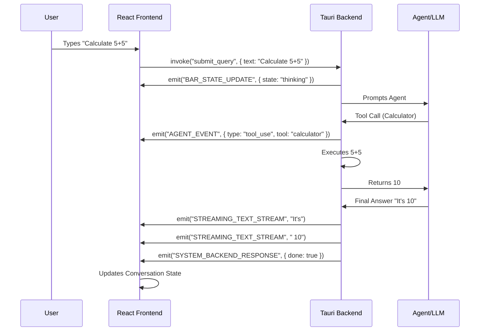
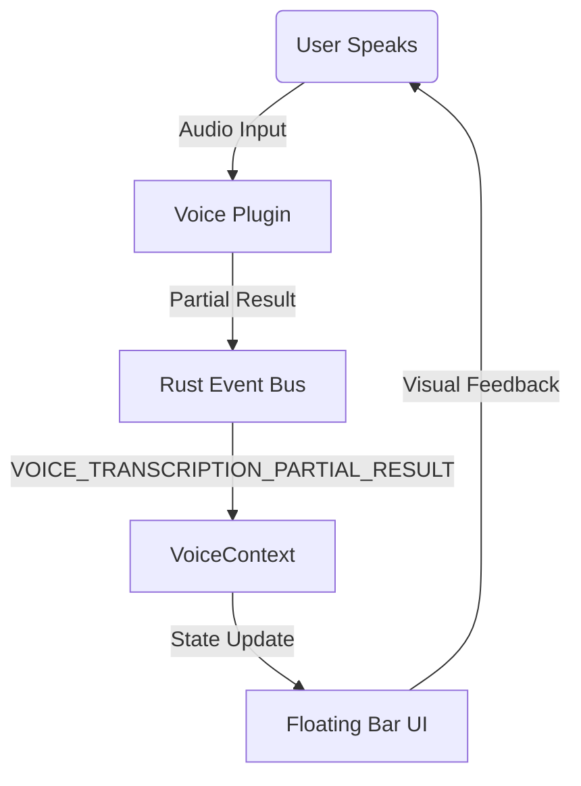

# Event Flow & Data Architecture

Juno interactions are circular: Frontend -> Backend -> Frontend.

## Core Interaction Loop

## Voice Flow

## Key Event Handlers
- **`useBackendEvents.ts`**: The "Router" for incoming events. It contains a massive switch/case (or individual `useEffect` hooks) mapping event names to state setters.
- **`App.tsx`**: Listens for `WINDOW_FOCUS` or `SHORTCUT_TRIGGERED` to bring the app to the foreground.
