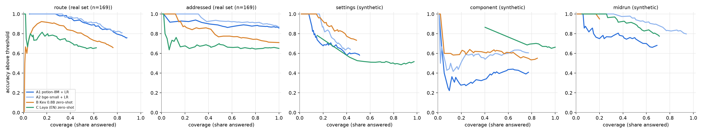
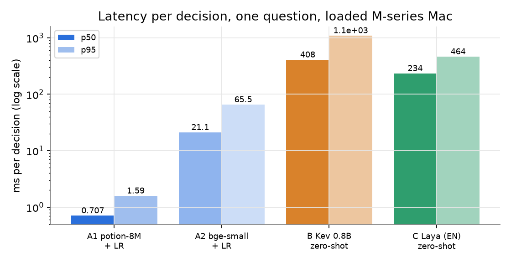
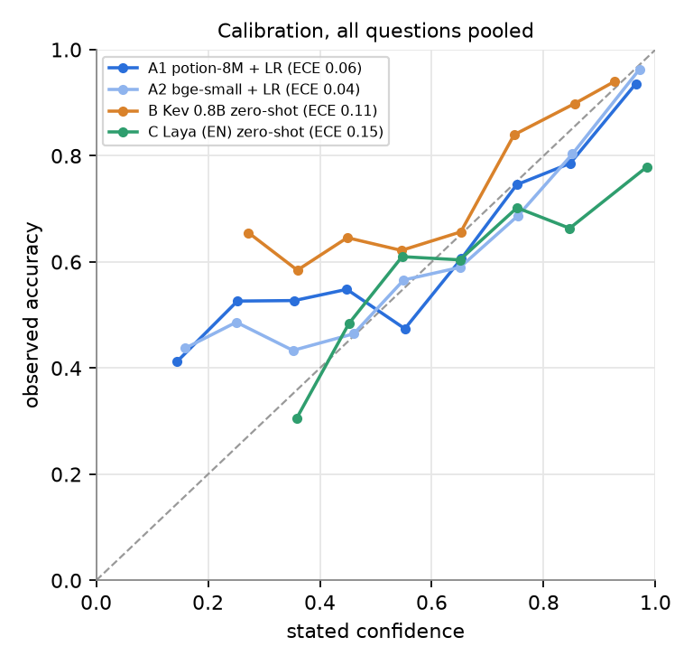

# Juno decision-model benchmark

Run date 2026-10-08, one Mac, Apple Silicon. Caveats: the machine was under heavy load from other agents (load average 50 to 90 during runs), so all latencies are inflated and noisy. The real set is small (169 requests, 5 folds grouped by session), so one item is 0.6 points and most differences under about 5 points are noise. The real set has almost no settings requests (1 of 169) and 19 component requests; midrun has no real data (synthetic only). Synthetic rows are hand-written by one author and the A heads trained on synthetic from the same author, and A sees only about 4 training examples per settings pane per fold, so synthetic scores for A are low-data numbers, not a ceiling. Fine-tuning Kev and Laya on the same folds was skipped (it would exceed the 1 hour compute budget on a loaded Mac). Jev was skipped: no key in ~/.paperclip/secrets. The JevAdapter exists in bench.py and would only ever send synthetic rows. Kev and Laya are zero-shot (not trained on any of this data). No real text appears in this file or the charts.

## Verdict

1. A small text head wins on what matters: potion-8M + LR gets 73.4% route and 85.8% addressed on real data (5-fold, session-grouped) at 0.7 ms p50; bge-small + LR is the same on route and 87.0% on addressed at 21 ms. Zero-shot Kev (59.8% route) and Laya (60.4%) trail by 13 points and cost 230 to 410 ms.
2. Wrong-ignore: no candidate ignored a real for-Juno item above 0.9. Zero wrong-ignores on real data at 0.76 (potion, 83% coverage), 0.66 (bge, 92%), 0.75 (Kev, 12%), 0.88 (Laya, 3%). The A heads almost never ignore anything (recall of true side talk is 0 to 4% there), which is the safe direction: default to answering.
3. Settings and component wrong-action is 0% for A on real data and on synthetic settings near-misses (bge 2.5% at 0.5). Kev has 22.5% on near-misses at 0.5 and 0% at 0.7; Laya is unsafe (45% of near-misses acted on at any threshold). Gate any settings action at 0.7 or higher.
4. With little data A is weak on the 23-way settings and 11-way component questions (53 to 58% and 45 to 58% on synthetic, cross-validated); Kev is best there only at high thresholds with low coverage. Midrun: bge head 75%, 94% above 0.9 at 51% coverage; this is synthetic-only, so unproven on real speech.
5. Zero-shot Kev and Laya flip their top answer on 20% of items when options are reshuffled; shuffle and vote if they are ever used. Fine-tuned Kev/Laya and Jev are untested here.

## Accuracy and ECE

| Question | Subset | n | A1 potion-8M + LR | A2 bge-small + LR | B Kev 0.8B zero-shot | C Laya (EN) zero-shot |
|---|---|---|---|---|---|---|
| route | real | 169 | 73.4% (ECE 0.08) | 73.4% (ECE 0.07) | 59.8% (ECE 0.12) | 60.4% (ECE 0.08) |
| addressed | real | 169 | 85.8% (ECE 0.08) | 87.0% (ECE 0.04) | 71.0% (ECE 0.07) | 65.1% (ECE 0.09) |
| settings | real | 169 | 99.4% (ECE 0.05) | 99.4% (ECE 0.03) | 92.9% (ECE 0.52) | 85.8% (ECE 0.08) |
| settings | syn | 155 | 53.5% (ECE 0.19) | 58.1% (ECE 0.21) | 51.6% (ECE 0.09) | 51.0% (ECE 0.41) |
| component | real | 169 | 94.1% (ECE 0.06) | 94.1% (ECE 0.04) | 92.3% (ECE 0.09) | 86.4% (ECE 0.12) |
| component | syn | 92 | 44.6% (ECE 0.29) | 57.6% (ECE 0.16) | 55.4% (ECE 0.18) | 66.3% (ECE 0.33) |
| midrun | syn | 100 | 64.0% (ECE 0.10) | 75.0% (ECE 0.11) | 59.0% (ECE 0.15) | 65.0% (ECE 0.07) |

## Accuracy above threshold (coverage in brackets)

**route (real)**

| Candidate | >=0.5 | >=0.6 | >=0.7 | >=0.8 | >=0.9 | >=0.95 |
|---|---|---|---|---|---|---|
| A1 potion-8M + LR | 76% (88%) | 85% (73%) | 88% (63%) | 91% (52%) | 98% (37%) | 100% (25%) |
| A2 bge-small + LR | 81% (84%) | 83% (77%) | 91% (62%) | 91% (54%) | 97% (38%) | 100% (26%) |
| B Kev 0.8B zero-shot | 66% (76%) | 73% (60%) | 88% (34%) | 75% (5%) | 0% (1%) | n/a (0%) |
| C Laya (EN) zero-shot | 66% (62%) | 69% (43%) | 78% (27%) | 81% (16%) | 71% (4%) | 100% (1%) |

**addressed (real)**

| Candidate | >=0.5 | >=0.6 | >=0.7 | >=0.8 | >=0.9 | >=0.95 |
|---|---|---|---|---|---|---|
| A1 potion-8M + LR | 86% (100%) | 87% (96%) | 87% (91%) | 88% (77%) | 87% (54%) | 94% (29%) |
| A2 bge-small + LR | 87% (100%) | 88% (98%) | 90% (90%) | 92% (78%) | 92% (55%) | 100% (31%) |
| B Kev 0.8B zero-shot | 71% (100%) | 77% (62%) | 86% (21%) | 100% (8%) | 100% (1%) | n/a (0%) |
| C Laya (EN) zero-shot | 65% (100%) | 65% (76%) | 68% (46%) | 68% (20%) | 80% (3%) | n/a (0%) |

**settings (syn)**

| Candidate | >=0.5 | >=0.6 | >=0.7 | >=0.8 | >=0.9 | >=0.95 |
|---|---|---|---|---|---|---|
| A1 potion-8M + LR | 58% (51%) | 59% (39%) | 69% (31%) | 69% (23%) | 76% (14%) | 82% (11%) |
| A2 bge-small + LR | 64% (43%) | 66% (36%) | 75% (28%) | 84% (24%) | 100% (16%) | 100% (13%) |
| B Kev 0.8B zero-shot | 73% (48%) | 88% (27%) | 100% (13%) | 100% (6%) | 100% (1%) | n/a (0%) |
| C Laya (EN) zero-shot | 52% (97%) | 51% (94%) | 50% (89%) | 49% (81%) | 51% (73%) | 51% (65%) |

**component (syn)**

| Candidate | >=0.5 | >=0.6 | >=0.7 | >=0.8 | >=0.9 | >=0.95 |
|---|---|---|---|---|---|---|
| A1 potion-8M + LR | 41% (77%) | 41% (55%) | 39% (45%) | 27% (24%) | 33% (13%) | 40% (5%) |
| A2 bge-small + LR | 61% (77%) | 60% (60%) | 56% (42%) | 58% (26%) | 50% (11%) | 50% (7%) |
| B Kev 0.8B zero-shot | 55% (85%) | 58% (67%) | 63% (50%) | 62% (32%) | 60% (5%) | 100% (1%) |
| C Laya (EN) zero-shot | 66% (100%) | 66% (100%) | 66% (99%) | 65% (97%) | 67% (92%) | 68% (88%) |

**midrun (syn)**

| Candidate | >=0.5 | >=0.6 | >=0.7 | >=0.8 | >=0.9 | >=0.95 |
|---|---|---|---|---|---|---|
| A1 potion-8M + LR | 68% (69%) | 75% (51%) | 74% (43%) | 77% (31%) | 86% (14%) | 88% (8%) |
| A2 bge-small + LR | 80% (94%) | 84% (85%) | 83% (82%) | 90% (63%) | 94% (51%) | 97% (39%) |
| B Kev 0.8B zero-shot | 95% (20%) | 100% (9%) | 100% (6%) | 100% (1%) | n/a (0%) | n/a (0%) |
| C Laya (EN) zero-shot | 77% (71%) | 83% (58%) | 91% (47%) | 92% (40%) | 96% (27%) | 100% (15%) |

## Wrong-ignore (real for-Juno items predicted not_for_juno)

Rate = real for-Juno items with P(not_for_juno) >= t, as a share of for-Juno items. Zero threshold = lowest t on a 0.01 grid (0.50 to 1.00) with no wrong-ignores on real data. Coverage = share of all real items with top probability >= t. Ignore recall = share of real not_for_juno items that would be ignored at t.

| Candidate | rate @0.5 | @0.7 | @0.9 | zero threshold | coverage there | ignore recall there |
|---|---|---|---|---|---|---|
| A1 potion-8M + LR | 1.4% (2) | 0.7% (1) | 0.0% (0) | 0.76 | 83% | 0% |
| A2 bge-small + LR | 1.4% (2) | 0.0% (0) | 0.0% (0) | 0.66 | 92% | 4% |
| B Kev 0.8B zero-shot | 28.8% (42) | 2.1% (3) | 0.0% (0) | 0.75 | 12% | 4% |
| C Laya (EN) zero-shot | 36.3% (53) | 15.1% (22) | 0.0% (0) | 0.88 | 3% | 0% |

Real set: 146 for-Juno items (includes all mic checks and greetings), 23 not_for_juno.

Synthetic midrun, same measure (non-side-talk utterances predicted not_for_juno):

| Candidate | rate @0.5 | @0.9 | zero threshold | coverage there |
|---|---|---|---|---|
| A1 potion-8M + LR | 6.7% | 2.7% | 0.97 | 6% |
| A2 bge-small + LR | 6.7% | 0.0% | 0.81 | 62% |
| B Kev 0.8B zero-shot | 0.0% | 0.0% | 0.50 | 20% |
| C Laya (EN) zero-shot | 10.7% | 0.0% | 0.70 | 47% |

## Wrong-action (non-none answer above threshold where truth is none)

| Question | Subset | Candidate | @0.5 | @0.7 | @0.9 | n truth-none |
|---|---|---|---|---|---|---|
| settings | real (all none) | A1 potion-8M + LR | 0.0% | 0.0% | 0.0% | 169 |
| settings | real (all none) | A2 bge-small + LR | 0.0% | 0.0% | 0.0% | 169 |
| settings | real (all none) | B Kev 0.8B zero-shot | 3.0% | 0.6% | 0.0% | 169 |
| settings | real (all none) | C Laya (EN) zero-shot | 12.4% | 10.7% | 5.9% | 169 |
| settings | synthetic near-misses | A1 potion-8M + LR | 0.0% | 0.0% | 0.0% | 40 |
| settings | synthetic near-misses | A2 bge-small + LR | 2.5% | 0.0% | 0.0% | 40 |
| settings | synthetic near-misses | B Kev 0.8B zero-shot | 22.5% | 0.0% | 0.0% | 40 |
| settings | synthetic near-misses | C Laya (EN) zero-shot | 45.0% | 45.0% | 45.0% | 40 |
| component | real (all none) | A1 potion-8M + LR | 0.7% | 0.0% | 0.0% | 150 |
| component | real (all none) | A2 bge-small + LR | 0.0% | 0.0% | 0.0% | 150 |
| component | real (all none) | B Kev 0.8B zero-shot | 0.7% | 0.0% | 0.0% | 150 |
| component | real (all none) | C Laya (EN) zero-shot | 8.0% | 8.0% | 6.0% | 150 |
| component | synthetic near-misses | A1 potion-8M + LR | 15.0% | 5.0% | 0.0% | 20 |
| component | synthetic near-misses | A2 bge-small + LR | 5.0% | 5.0% | 0.0% | 20 |
| component | synthetic near-misses | B Kev 0.8B zero-shot | 5.0% | 5.0% | 0.0% | 20 |
| component | synthetic near-misses | C Laya (EN) zero-shot | 35.0% | 35.0% | 30.0% | 20 |

## Latency (ms per decision, warm, loaded machine)

| Candidate | p50 | p95 | calls |
|---|---|---|---|
| A1 potion-8M + LR | 0.7 | 1.6 | 1023 |
| A2 bge-small + LR | 21.1 | 65.5 | 1023 |
| B Kev 0.8B zero-shot | 408.1 | 1095.1 | 1023 |
| C Laya (EN) zero-shot | 234.2 | 463.8 | 1023 |

A1 and A2 time the full path: embed one utterance, then the head. Kev is a loopback HTTP call to a local MLX server. Laya runs in-process on MPS.

## Option-order sensitivity (30 items, 3 shuffles)

| Candidate | top answer changed | mean spread of top probability | accuracy per shuffle |
|---|---|---|---|
| A1 potion-8M + LR | 0% | 0.00 | 53%, 53%, 53% |
| A2 bge-small + LR | 0% | 0.00 | 67%, 67%, 67% |
| B Kev 0.8B zero-shot | 20% | 0.05 | 60%, 57%, 50% |
| C Laya (EN) zero-shot | 20% | 0.12 | 63%, 53%, 60% |

A heads are order-invariant by construction (they read labels, not positions), so 0 is expected, not an achievement.

## Charts

## Publishable facts

- Benchmark: 169 real voice-assistant requests (kept private, 5-fold cross-validation grouped by session) plus about 350 hand-written synthetic rows; options reshuffled with a fixed seed on every call.
- A 7.5M-parameter static embedding (Model2Vec potion-base-8M) with logistic-regression heads decides in about 0.7 ms on an Apple Silicon Mac, versus 21 ms for bge-small heads, 230 ms for Laya (ModernBERT-large, zero-shot) and 410 ms for Kev 0.8B (zero-shot, local MLX server). The machine was heavily loaded.
- On the real set the small heads reached 73% on a 4-way routing question and 86 to 87% on an addressed-or-not question; zero-shot Kev and Laya reached about 60% on routing.
- Zero-shot models changed their top answer on 20% of items when only the option order changed; the trained heads are order-invariant.
- Real set is small (169 items), so treat differences under about 5 points as noise.
