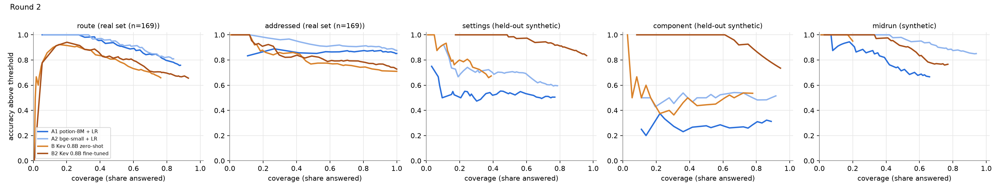
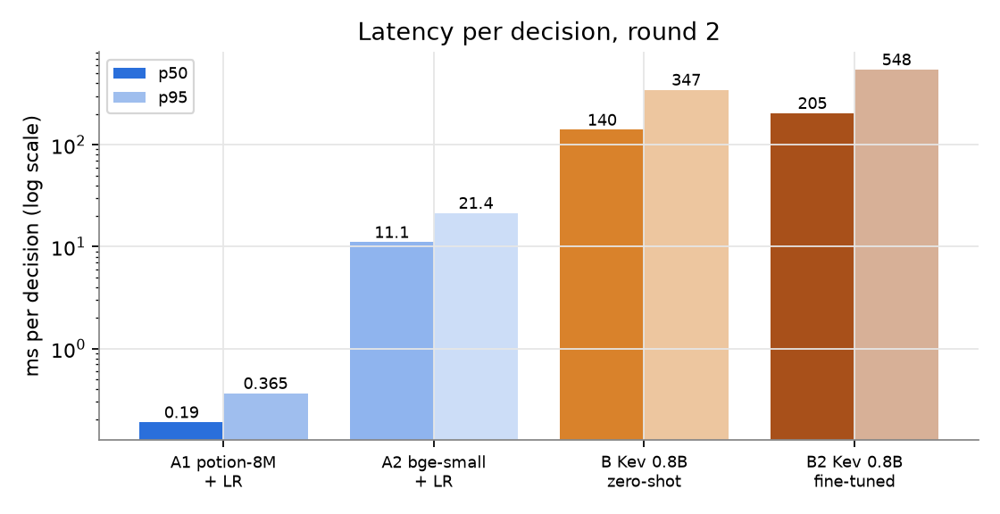
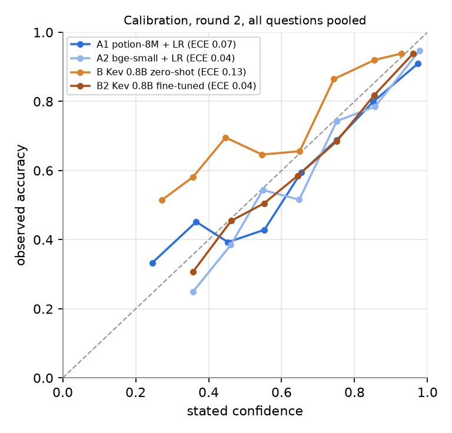

# Juno decision-model benchmark, rounds 1 and 2

Run 2026-10-09 on one Apple Silicon Mac. The machine may be under load from other jobs (load average was 2 to 7 during runs), so latencies are noisy. The real set is small (169 requests, 146 for Juno, 23 not), scored 5-fold grouped by session, so one item is 0.6 points. Real text never leaves ~/.juno-bench and appears in no output or chart.

Round 2 changes: settings options now follow the merged Juno registry (11 panes: general, triggers, audio, providers, models, notifications, tools, automations, network, security, advanced) plus 13 macOS panes, 24 options plus none. Synthetic settings and component sets were rewritten (synthetic_v2.jsonl: 480 settings positives, 150 near-miss none, 150 component positives, 30 component near-misses), grouped into paraphrase families and split 80/20 by family. Settings and component are scored on the held-out 20% only (126 settings rows including 30 near-misses, 36 component rows including 6 near-misses; about 4 rows per settings pane and 3 per component class). A heads train on the 80% family split plus real folds; Kev zero-shot sees none of it. Round-1 midrun, route and addressed are unchanged. Laya dropped; Jev skipped (no key).

## Round 2 verdict

1. Held-out paraphrase families are hard for every small head: settings accuracy fell to 45% (potion) and 54% (bge) across 24 panes plus none, and zero-shot Kev is 56%. Round-1 synthetic scores were inflated by near-identical phrasings leaking across folds. Treat round 2 as the honest number.
2. Fine-tuning helps where it was trained: Kev 0.8B went from 56% to 82% on held-out settings and 56% to 72% on held-out component rows, and holds zero wrong-action on near-misses at 0.76 with 71% coverage (94% accurate). It cost 60 minutes of compute and about 200 ms per decision.
3. The fine-tune over-fires on real talk it never saw: 8.9% of real "none" requests got a settings pane at 0.5 and 5.9% at 0.7 (zero only at 0.93). Gate settings actions at 0.9 or higher, and add real near-miss negatives before any ship decision.
4. Real-data routing and addressing did not move: A heads 73.4% route and 85 to 88% addressed on real, Kev about 60% and 71%. Wrong-ignores on real data vanish by 0.91 for every candidate; the A heads reach zero wrong-ignore with 86% (potion, 0.79) and 97% (bge, 0.54) coverage but catch almost none of the true side talk.
5. Near-miss wrong-action for the A heads is worse in round 2 (20 to 27% at 0.5, 10% at 0.7, zero only at 0.89 for bge), because the new near-misses (questions about settings, other apps) are close to real commands. Use 0.9 for any settings action.

## Headline, round 1 vs round 2

Settings and component "synthetic" columns use the held-out families in round 2; in round 1 they use the whole round-1 synthetic set (different options, 5-fold), so compare directionally. Wrong-action zero threshold is on the synthetic near-misses (30 in round 2).

| Candidate | Round | Route (real) | Addressed (real) | Wrong-ignore zero t, coverage | Settings acc (synthetic) | Settings wrong-action near-miss @0.5 / @0.7 / @0.9 | Zero-WA t, coverage, acc | p50 ms |
|---|---|---|---|---|---|---|---|---|
| A1 potion-8M | 1 | 73.4% | 85.8% | 0.76, 83% | 53.5% | 0% / 0% / 0% | 0.50, 51%, 58% | 0.2 |
| A1 potion-8M | 2 | 73.4% | 85.2% | 0.79, 86% | 45.2% | 27% / 10% / 3% | 0.96, 10%, 50% | 0.2 |
| A2 bge-small | 1 | 73.4% | 87.0% | 0.66, 92% | 58.1% | 3% / 0% / 0% | 0.55, 38%, 64% | 13 |
| A2 bge-small | 2 | 73.4% | 87.6% | 0.54, 97% | 54.0% | 20% / 10% / 0% | 0.89, 25%, 74% | 11 |
| B Kev 0.8B zero-shot | 1 | 59.8% | 71.0% | 0.75, 12% | 51.6% | 23% / 0% / 0% | 0.69, 14%, 100% | 145 |
| B Kev 0.8B zero-shot | 2 | 59.8% | 71.0% | 0.75, 12% | 55.6% | 33% / 3% / 0% | 0.81, 5%, 100% | 140 |
| B2 Kev 0.8B fine-tuned | 2 | 63.3% | 72.8% | 0.91, 17% | 81.7% | 13% / 7% / 0% | 0.76, 71%, 94% | 205 |

Kev fine-tune: LoRA warm-started from jaredpalmer/kev-0.8b, 100 optimizer steps (800 records of the 1,296 built from the 648 round-2 training-family rows, two option orders each), lr 5e-5, MPS, 60 minutes of compute (cap met; 1 epoch instead of 2). It trained on synthetic settings and component rows only, never on real data or on any held-out family, so its real-set scores are clean but it is not the 5-fold design used for A. Real-set settings wrong-action for the fine-tune is 8.9% @0.5, 5.9% @0.7, 0.6% @0.9 (zero at 0.93), against 0% for A1 and 0.6% for A2 at 0.5.

## Round 2

### Accuracy and ECE (settings and component use the 20% held-out synthetic families)

| Question | Subset | n | A1 potion-8M + LR | A2 bge-small + LR | B Kev 0.8B zero-shot | B2 Kev 0.8B fine-tuned |
|---|---|---|---|---|---|---|
| route | real | 169 | 73.4% (ECE 0.08) | 73.4% (ECE 0.07) | 59.8% (ECE 0.12) | 63.3% (ECE 0.17) |
| addressed | real | 169 | 85.2% (ECE 0.08) | 87.6% (ECE 0.04) | 71.0% (ECE 0.07) | 72.8% (ECE 0.05) |
| settings | real | 169 | 97.0% (ECE 0.06) | 98.8% (ECE 0.03) | 86.4% (ECE 0.45) | 86.4% (ECE 0.07) |
| settings | syn | 126 | 45.2% (ECE 0.23) | 54.0% (ECE 0.17) | 55.6% (ECE 0.08) | 81.7% (ECE 0.04) |
| component | real | 169 | 94.7% (ECE 0.02) | 91.1% (ECE 0.04) | 92.3% (ECE 0.09) | 82.8% (ECE 0.06) |
| component | syn | 36 | 30.6% (ECE 0.50) | 52.8% (ECE 0.25) | 55.6% (ECE 0.28) | 72.2% (ECE 0.17) |
| midrun | syn | 100 | 60.0% (ECE 0.08) | 82.0% (ECE 0.05) | 59.0% (ECE 0.15) | 70.0% (ECE 0.09) |

### Accuracy above threshold (coverage in brackets)

**route (real)**

| Candidate | >=0.5 | >=0.6 | >=0.7 | >=0.8 | >=0.9 | >=0.95 |
|---|---|---|---|---|---|---|
| A1 potion-8M + LR | 76% (88%) | 85% (73%) | 88% (63%) | 91% (52%) | 98% (37%) | 100% (25%) |
| A2 bge-small + LR | 81% (84%) | 83% (77%) | 91% (62%) | 91% (54%) | 97% (38%) | 100% (26%) |
| B Kev 0.8B zero-shot | 66% (76%) | 73% (60%) | 88% (34%) | 75% (5%) | 0% (1%) | n/a (0%) |
| B2 Kev 0.8B fine-tuned | 66% (93%) | 67% (85%) | 73% (68%) | 81% (59%) | 83% (41%) | 91% (28%) |

**addressed (real)**

| Candidate | >=0.5 | >=0.6 | >=0.7 | >=0.8 | >=0.9 | >=0.95 |
|---|---|---|---|---|---|---|
| A1 potion-8M + LR | 85% (100%) | 87% (96%) | 87% (93%) | 87% (85%) | 87% (66%) | 85% (49%) |
| A2 bge-small + LR | 88% (100%) | 89% (96%) | 89% (93%) | 91% (80%) | 92% (64%) | 94% (42%) |
| B Kev 0.8B zero-shot | 71% (100%) | 77% (62%) | 86% (21%) | 100% (8%) | 100% (1%) | n/a (0%) |
| B2 Kev 0.8B fine-tuned | 73% (100%) | 77% (83%) | 79% (66%) | 83% (39%) | 91% (20%) | 100% (11%) |

**settings (syn)**

| Candidate | >=0.5 | >=0.6 | >=0.7 | >=0.8 | >=0.9 | >=0.95 |
|---|---|---|---|---|---|---|
| A1 potion-8M + LR | 51% (77%) | 52% (64%) | 55% (44%) | 53% (36%) | 55% (23%) | 53% (15%) |
| A2 bge-small + LR | 60% (79%) | 63% (68%) | 71% (54%) | 69% (40%) | 71% (22%) | 73% (17%) |
| B Kev 0.8B zero-shot | 67% (39%) | 80% (20%) | 92% (10%) | 88% (6%) | 100% (1%) | n/a (0%) |
| B2 Kev 0.8B fine-tuned | 83% (96%) | 89% (86%) | 92% (78%) | 94% (67%) | 98% (52%) | 100% (37%) |

**component (syn)**

| Candidate | >=0.5 | >=0.6 | >=0.7 | >=0.8 | >=0.9 | >=0.95 |
|---|---|---|---|---|---|---|
| A1 potion-8M + LR | 31% (89%) | 31% (81%) | 27% (72%) | 29% (58%) | 28% (50%) | 27% (31%) |
| A2 bge-small + LR | 52% (92%) | 54% (67%) | 50% (50%) | 47% (42%) | 50% (33%) | 50% (28%) |
| B Kev 0.8B zero-shot | 54% (78%) | 50% (67%) | 46% (36%) | 40% (28%) | 50% (11%) | n/a (0%) |
| B2 Kev 0.8B fine-tuned | 74% (94%) | 83% (83%) | 92% (72%) | 100% (61%) | 100% (47%) | 100% (31%) |

**midrun (syn)**

| Candidate | >=0.5 | >=0.6 | >=0.7 | >=0.8 | >=0.9 | >=0.95 |
|---|---|---|---|---|---|---|
| A1 potion-8M + LR | 67% (66%) | 69% (58%) | 76% (42%) | 87% (31%) | 93% (14%) | 100% (7%) |
| A2 bge-small + LR | 85% (94%) | 87% (85%) | 88% (78%) | 94% (66%) | 98% (49%) | 100% (34%) |
| B Kev 0.8B zero-shot | 95% (20%) | 100% (9%) | 100% (6%) | 100% (1%) | n/a (0%) | n/a (0%) |
| B2 Kev 0.8B fine-tuned | 77% (77%) | 84% (61%) | 95% (43%) | 100% (30%) | 100% (19%) | 100% (16%) |

### Wrong-ignore (real for-Juno items predicted not_for_juno)

Rate = real for-Juno items with P(not_for_juno) >= t. Zero threshold = lowest t on a 0.01 grid with no wrong-ignores on real data. Coverage = share of all real items with top probability >= t. Ignore recall = share of real not_for_juno items ignored at t.

| Candidate | rate @0.5 | @0.7 | @0.9 | zero threshold | coverage there | ignore recall there |
|---|---|---|---|---|---|---|
| A1 potion-8M + LR | 2.1% (3) | 0.7% (1) | 0.0% (0) | 0.79 | 86% | 0% |
| A2 bge-small + LR | 1.4% (2) | 0.0% (0) | 0.0% (0) | 0.54 | 97% | 9% |
| B Kev 0.8B zero-shot | 28.8% (42) | 2.1% (3) | 0.0% (0) | 0.75 | 12% | 4% |
| B2 Kev 0.8B fine-tuned | 24.7% (36) | 11.0% (16) | 0.7% (1) | 0.91 | 17% | 0% |

Real set: 146 for-Juno items (all mic checks and greetings included), 23 not_for_juno.

### Wrong-action: non-none answer at or above threshold where truth is none

Zero-WA threshold = lowest t with no wrong-action; coverage = share of that subset's items answered at t; acc = accuracy of the answered items.

| Question | Truth-none subset | Candidate | @0.5 | @0.6 | @0.7 | @0.8 | @0.9 | @0.95 | zero-WA t | coverage | acc | n |
|---|---|---|---|---|---|---|---|---|---|---|---|---|
| settings | real (all none) | A1 potion-8M + LR | 0.0% | 0.0% | 0.0% | 0.0% | 0.0% | 0.0% | 0.50 | 97% | 100% | 169 |
| settings | real (all none) | A2 bge-small + LR | 0.6% | 0.0% | 0.0% | 0.0% | 0.0% | 0.0% | 0.55 | 97% | 100% | 169 |
| settings | real (all none) | B Kev 0.8B zero-shot | 1.2% | 0.6% | 0.0% | 0.0% | 0.0% | 0.0% | 0.61 | 4% | 100% | 169 |
| settings | real (all none) | B2 Kev 0.8B fine-tuned | 8.9% | 7.7% | 5.9% | 2.4% | 0.6% | 0.0% | 0.93 | 49% | 100% | 169 |
| settings | synthetic near-misses | A1 potion-8M + LR | 26.7% | 16.7% | 10.0% | 10.0% | 3.3% | 3.3% | 0.96 | 10% | 50% | 30 |
| settings | synthetic near-misses | A2 bge-small + LR | 20.0% | 16.7% | 10.0% | 6.7% | 0.0% | 0.0% | 0.89 | 25% | 74% | 30 |
| settings | synthetic near-misses | B Kev 0.8B zero-shot | 33.3% | 13.3% | 3.3% | 3.3% | 0.0% | 0.0% | 0.81 | 5% | 100% | 30 |
| settings | synthetic near-misses | B2 Kev 0.8B fine-tuned | 13.3% | 6.7% | 6.7% | 0.0% | 0.0% | 0.0% | 0.76 | 71% | 94% | 30 |
| component | real (all none) | A1 potion-8M + LR | 0.0% | 0.0% | 0.0% | 0.0% | 0.0% | 0.0% | 0.50 | 97% | 96% | 150 |
| component | real (all none) | A2 bge-small + LR | 1.3% | 1.3% | 0.7% | 0.0% | 0.0% | 0.0% | 0.72 | 91% | 96% | 150 |
| component | real (all none) | B Kev 0.8B zero-shot | 0.7% | 0.7% | 0.0% | 0.0% | 0.0% | 0.0% | 0.62 | 93% | 94% | 150 |
| component | real (all none) | B2 Kev 0.8B fine-tuned | 13.3% | 11.3% | 8.0% | 6.7% | 3.3% | 0.7% | 0.98 | 9% | 100% | 150 |
| component | synthetic near-misses | A1 potion-8M + LR | 33.3% | 33.3% | 33.3% | 16.7% | 16.7% | 16.7% | 0.99 | 11% | 25% | 6 |
| component | synthetic near-misses | A2 bge-small + LR | 0.0% | 0.0% | 0.0% | 0.0% | 0.0% | 0.0% | 0.50 | 92% | 52% | 6 |
| component | synthetic near-misses | B Kev 0.8B zero-shot | 0.0% | 0.0% | 0.0% | 0.0% | 0.0% | 0.0% | 0.50 | 78% | 54% | 6 |
| component | synthetic near-misses | B2 Kev 0.8B fine-tuned | 33.3% | 33.3% | 0.0% | 0.0% | 0.0% | 0.0% | 0.69 | 75% | 93% | 6 |

### Latency (ms per decision, warm)

| Candidate | p50 | p95 | calls |
|---|---|---|---|
| A1 potion-8M + LR | 0.2 | 0.4 | 938 |
| A2 bge-small + LR | 11.1 | 21.4 | 938 |
| B Kev 0.8B zero-shot | 140.2 | 347.0 | 938 |
| B2 Kev 0.8B fine-tuned | 204.5 | 547.5 | 938 |

A1 and A2 time embed plus head. Kev is a loopback HTTP call to a local MLX server.

### Option-order sensitivity (30 items, 3 shuffles)

| Candidate | top answer changed | mean spread of top probability | accuracy per shuffle |
|---|---|---|---|
| A1 potion-8M + LR | 0% | 0.00 | 57%, 57%, 57% |
| A2 bge-small + LR | 0% | 0.00 | 73%, 73%, 73% |
| B Kev 0.8B zero-shot | 20% | 0.07 | 53%, 53%, 47% |
| B2 Kev 0.8B fine-tuned | 13% | 0.08 | 80%, 77%, 67% |

A heads are order-invariant by construction.

## Round 1 (kept for comparison)

### Accuracy and ECE

| Question | Subset | n | A1 potion-8M + LR | A2 bge-small + LR | B Kev 0.8B zero-shot |
|---|---|---|---|---|---|
| route | real | 169 | 73.4% (ECE 0.08) | 73.4% (ECE 0.07) | 59.8% (ECE 0.12) |
| addressed | real | 169 | 85.8% (ECE 0.08) | 87.0% (ECE 0.04) | 71.0% (ECE 0.07) |
| settings | real | 169 | 99.4% (ECE 0.05) | 99.4% (ECE 0.03) | 92.9% (ECE 0.52) |
| settings | syn | 155 | 53.5% (ECE 0.19) | 58.1% (ECE 0.21) | 51.6% (ECE 0.09) |
| component | real | 169 | 94.1% (ECE 0.06) | 94.1% (ECE 0.04) | 92.3% (ECE 0.09) |
| component | syn | 92 | 44.6% (ECE 0.29) | 57.6% (ECE 0.16) | 55.4% (ECE 0.18) |
| midrun | syn | 100 | 64.0% (ECE 0.10) | 75.0% (ECE 0.11) | 59.0% (ECE 0.15) |

### Accuracy above threshold (coverage in brackets)

**route (real)**

| Candidate | >=0.5 | >=0.6 | >=0.7 | >=0.8 | >=0.9 | >=0.95 |
|---|---|---|---|---|---|---|
| A1 potion-8M + LR | 76% (88%) | 85% (73%) | 88% (63%) | 91% (52%) | 98% (37%) | 100% (25%) |
| A2 bge-small + LR | 81% (84%) | 83% (77%) | 91% (62%) | 91% (54%) | 97% (38%) | 100% (26%) |
| B Kev 0.8B zero-shot | 66% (76%) | 73% (60%) | 88% (34%) | 75% (5%) | 0% (1%) | n/a (0%) |

**addressed (real)**

| Candidate | >=0.5 | >=0.6 | >=0.7 | >=0.8 | >=0.9 | >=0.95 |
|---|---|---|---|---|---|---|
| A1 potion-8M + LR | 86% (100%) | 87% (96%) | 87% (91%) | 88% (77%) | 87% (54%) | 94% (29%) |
| A2 bge-small + LR | 87% (100%) | 88% (98%) | 90% (90%) | 92% (78%) | 92% (55%) | 100% (31%) |
| B Kev 0.8B zero-shot | 71% (100%) | 77% (62%) | 86% (21%) | 100% (8%) | 100% (1%) | n/a (0%) |

**settings (syn)**

| Candidate | >=0.5 | >=0.6 | >=0.7 | >=0.8 | >=0.9 | >=0.95 |
|---|---|---|---|---|---|---|
| A1 potion-8M + LR | 58% (51%) | 59% (39%) | 69% (31%) | 69% (23%) | 76% (14%) | 82% (11%) |
| A2 bge-small + LR | 64% (43%) | 66% (36%) | 75% (28%) | 84% (24%) | 100% (16%) | 100% (13%) |
| B Kev 0.8B zero-shot | 73% (48%) | 88% (27%) | 100% (13%) | 100% (6%) | 100% (1%) | n/a (0%) |

**component (syn)**

| Candidate | >=0.5 | >=0.6 | >=0.7 | >=0.8 | >=0.9 | >=0.95 |
|---|---|---|---|---|---|---|
| A1 potion-8M + LR | 41% (77%) | 41% (55%) | 39% (45%) | 27% (24%) | 33% (13%) | 40% (5%) |
| A2 bge-small + LR | 61% (77%) | 60% (60%) | 56% (42%) | 58% (26%) | 50% (11%) | 50% (7%) |
| B Kev 0.8B zero-shot | 55% (85%) | 58% (67%) | 63% (50%) | 62% (32%) | 60% (5%) | 100% (1%) |

**midrun (syn)**

| Candidate | >=0.5 | >=0.6 | >=0.7 | >=0.8 | >=0.9 | >=0.95 |
|---|---|---|---|---|---|---|
| A1 potion-8M + LR | 68% (69%) | 75% (51%) | 74% (43%) | 77% (31%) | 86% (14%) | 88% (8%) |
| A2 bge-small + LR | 80% (94%) | 84% (85%) | 83% (82%) | 90% (63%) | 94% (51%) | 97% (39%) |
| B Kev 0.8B zero-shot | 95% (20%) | 100% (9%) | 100% (6%) | 100% (1%) | n/a (0%) | n/a (0%) |

### Wrong-ignore (real for-Juno items predicted not_for_juno)

Rate = real for-Juno items with P(not_for_juno) >= t. Zero threshold = lowest t on a 0.01 grid with no wrong-ignores on real data. Coverage = share of all real items with top probability >= t. Ignore recall = share of real not_for_juno items ignored at t.

| Candidate | rate @0.5 | @0.7 | @0.9 | zero threshold | coverage there | ignore recall there |
|---|---|---|---|---|---|---|
| A1 potion-8M + LR | 1.4% (2) | 0.7% (1) | 0.0% (0) | 0.76 | 83% | 0% |
| A2 bge-small + LR | 1.4% (2) | 0.0% (0) | 0.0% (0) | 0.66 | 92% | 4% |
| B Kev 0.8B zero-shot | 28.8% (42) | 2.1% (3) | 0.0% (0) | 0.75 | 12% | 4% |

Real set: 146 for-Juno items (all mic checks and greetings included), 23 not_for_juno.

### Wrong-action: non-none answer at or above threshold where truth is none

Zero-WA threshold = lowest t with no wrong-action; coverage = share of that subset's items answered at t; acc = accuracy of the answered items.

| Question | Truth-none subset | Candidate | @0.5 | @0.6 | @0.7 | @0.8 | @0.9 | @0.95 | zero-WA t | coverage | acc | n |
|---|---|---|---|---|---|---|---|---|---|---|---|---|
| settings | real (all none) | A1 potion-8M + LR | 0.0% | 0.0% | 0.0% | 0.0% | 0.0% | 0.0% | 0.50 | 99% | 100% | 169 |
| settings | real (all none) | A2 bge-small + LR | 0.0% | 0.0% | 0.0% | 0.0% | 0.0% | 0.0% | 0.50 | 99% | 100% | 169 |
| settings | real (all none) | B Kev 0.8B zero-shot | 3.0% | 0.6% | 0.6% | 0.0% | 0.0% | 0.0% | 0.75 | 0% | n/a | 169 |
| settings | synthetic near-misses | A1 potion-8M + LR | 0.0% | 0.0% | 0.0% | 0.0% | 0.0% | 0.0% | 0.50 | 51% | 58% | 40 |
| settings | synthetic near-misses | A2 bge-small + LR | 2.5% | 0.0% | 0.0% | 0.0% | 0.0% | 0.0% | 0.55 | 38% | 64% | 40 |
| settings | synthetic near-misses | B Kev 0.8B zero-shot | 22.5% | 7.5% | 0.0% | 0.0% | 0.0% | 0.0% | 0.69 | 14% | 100% | 40 |
| component | real (all none) | A1 potion-8M + LR | 0.7% | 0.7% | 0.0% | 0.0% | 0.0% | 0.0% | 0.68 | 89% | 97% | 150 |
| component | real (all none) | A2 bge-small + LR | 0.0% | 0.0% | 0.0% | 0.0% | 0.0% | 0.0% | 0.50 | 94% | 97% | 150 |
| component | real (all none) | B Kev 0.8B zero-shot | 0.7% | 0.7% | 0.0% | 0.0% | 0.0% | 0.0% | 0.62 | 93% | 94% | 150 |
| component | synthetic near-misses | A1 potion-8M + LR | 15.0% | 10.0% | 5.0% | 5.0% | 0.0% | 0.0% | 0.82 | 20% | 28% | 20 |
| component | synthetic near-misses | A2 bge-small + LR | 5.0% | 5.0% | 5.0% | 0.0% | 0.0% | 0.0% | 0.75 | 35% | 59% | 20 |
| component | synthetic near-misses | B Kev 0.8B zero-shot | 5.0% | 5.0% | 5.0% | 0.0% | 0.0% | 0.0% | 0.79 | 37% | 62% | 20 |

### Latency (ms per decision, warm)

| Candidate | p50 | p95 | calls |
|---|---|---|---|
| A1 potion-8M + LR | 0.2 | 0.3 | 1023 |
| A2 bge-small + LR | 13.4 | 27.7 | 1023 |
| B Kev 0.8B zero-shot | 144.7 | 302.3 | 1023 |

A1 and A2 time embed plus head. Kev is a loopback HTTP call to a local MLX server.

### Option-order sensitivity (30 items, 3 shuffles)

| Candidate | top answer changed | mean spread of top probability | accuracy per shuffle |
|---|---|---|---|
| A1 potion-8M + LR | 0% | 0.00 | 53%, 53%, 53% |
| A2 bge-small + LR | 0% | 0.00 | 67%, 67%, 67% |
| B Kev 0.8B zero-shot | 20% | 0.05 | 60%, 57%, 50% |

A heads are order-invariant by construction.

## Publishable facts

- Two rounds on 169 real requests (private, never uploaded) plus hand-written synthetic sets; round 2 splits synthetic phrasings 80/20 by paraphrase family and scores only the held-out families.
- Holding out whole paraphrase families cut small-head settings accuracy from 54 to 58% (round 1) to 45 to 54% (round 2) on a 24-pane question, so random-split synthetic scores overstate generalization.
- A short LoRA fine-tune of Kev 0.8B (100 steps, 60 minutes on one Mac GPU) raised held-out settings accuracy from 56% to 82%, but it also made the model act on 9% of real non-settings requests at 0.5 confidence, so thresholds matter more than accuracy.
- Static-embedding heads decide in 0.2 ms, bge-small heads in about 12 ms, Kev 0.8B in 140 to 205 ms on a loaded laptop.
- The real set is small (169), so treat gaps under about 5 points as noise.
